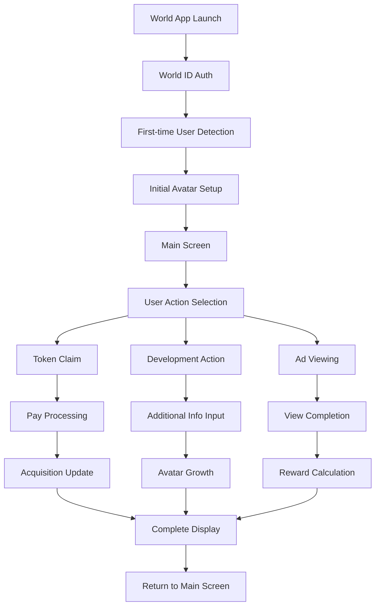

# MirrorMe Mini App Development Plan

## 1. Product Vision

**"MirrorMe"** - *"Let your digital self work for you"*

MirrorMe is a platform that leverages World ID's Proof of Personhood to create and manage digital copies (avatars) of users. These avatars reflect users' attributes and behavioral patterns, working on their behalf online to generate income.

## 2. Concept and Differentiation

### 2.1 Core Concept
1. **Creation** - Generation of digital avatars reflecting user characteristics
2. **Growth** - Enhancement of avatar capabilities through continuous information provision
3. **Autonomy** - A system where avatars automatically create value on behalf of users

This three-step cycle allows users to obtain increasing value with minimal effort.

### 2.2 Narrative - Why Now?

### 2.3 Features

#### Technical Features
- **Balancing Identity Verification and Anonymity**
 - Ensuring one-account-per-person system through World ID
 - Secure management of personal information through privacy protection technology
 
- **Learning Avatars**
 - Continuous model optimization based on user feedback

#### User Experience Innovation
- **Gamified Development Experience**
 - Visual representation of avatar growth
 - Step-up design with sense of achievement
 
- **Easy Access to Earnings**
 - Daily token claims for revenue generation, with claimable token amounts varying based on avatar development level

## 3. Business Model

### 3.1 Revenue Structure
- **Platform Fee**
 - A certain percentage (e.g., 20%) of the revenue generated by digital avatars

### 3.2 Examples of How Avatars Generate Revenue

#### Example 1: Personal Advertising Assistant
- **Mechanism**: Avatar selects and views optimal advertisements based on user preferences
- **Revenue Source**: Viewing rewards from advertisers

#### Example 2: Automatic Survey Responses
- **Mechanism**: Avatar automatically responds to surveys based on user profile
- **Revenue Source**: Response rewards from market research companies

#### Example 3: AI Training Data Provision
- **Mechanism**: Anonymous provision of user language patterns and preferences to AI development companies
- **Revenue Source**: Data usage fees from AI development companies

#### Example 4: Recommendation Influencer
- **Mechanism**: Avatar recommends products and content within the network
- **Revenue Source**: Affiliate rewards for purchases and usage through recommendations

#### Example 5: Avatar Collaboration
- **Mechanism**: Multiple avatars cooperate to accomplish tasks that cannot be achieved individually
- **Revenue Source**: Distribution of joint task achievement rewards and collaboration intermediary fees
- **Example**: Multiple avatars with different expertise or attributes team up to automatically generate market research reports, providing higher accuracy and value to earn revenue

### 3.3 Growth Strategy
- **Leveraging Network Effects**
 - Improvement of data accuracy and value with increasing users
 - Ecosystem enhancement through avatar interactions
 
- **Phased Market Expansion**
 - **Initial Phase**: Reach World App users
   * Provide basic avatar functionality as a mini app within World App
   * Focus on data utilization and value creation within the World community
 
 - **Mid-term Phase**: Enable avatar agents to be used in other ecosystems through interoperability
   * Expand to broader Web3 ecosystems through cross-chain support
   * Build API connections with external DApps and services
   * Achieve avatar portability through cross-platform support
 
 - **Long-term Phase**: Make avatar agents available for use in services beyond blockchain
   * Build infrastructure for integration with general Web2 services
   * Provide avatar management APIs for enterprises
   * Standardize avatar utilization frameworks across consumer services

## 4. Long-term Vision

**A world where users' digital copies continuously and autonomously generate revenue**

This specifically means a world where:

- Once users set up their avatars, they can earn continuous revenue with minimal effort thereafter
- Digital avatars autonomously select and execute optimal activities based on individual preferences and values
- Revenue-generating activities become diversified and automated, with users only checking results and rewards
- Avatars' capabilities improve through data and experience gained, enabling more advanced revenue-generating activities
- Avatars create value as user proxies across multiple platforms and services

In this world, a new paradigm is realized where the value generated from personal data is directly returned to individuals while protecting their privacy. Users can access more revenue opportunities by developing their avatars and enhancing their capabilities.

# MirrorMe MVP Development Requirements

## 1. Development Goal

Implement the basic functions of MirrorMe's core concept "Creation → Growth → Autonomy" cycle, enabling users to create and nurture digital avatars and experience basic monetization mechanisms through a Mini App.

## 2. Core Functionality Requirements

### 2.1 User Authentication & Avatar Creation
- **World ID Integration**
 - User authentication using MiniKit's Verify command
 - Mechanism to ensure one avatar per person
- **Basic Profile Creation**
 - Name, icon selection
 - Multiple-choice form for basic information (gender, location, areas of interest, occupation, etc.) with approximately 5 questions
- **Visual Avatar Representation**
 - Simple avatar display reflecting growth state

### 2.2 Avatar Development Functions
- **Information Input Interface**
 - Simple questions to enhance avatar data through user responses
 - Mechanism for avatar growth with each response
- **Growth Level Display**
 - Visualization of growth levels based on provided information (levels or status)
 - Display of daily claimable token amount boosts based on growth level

### 2.3 Monetization Functions
- **Ad Viewing Mechanism**
 - Users view actual ad content (embedded YouTube videos)
 - Token earning mechanism based on completed views
 - Token amount increases with avatar growth level
- **Token Acquisition & Claim Mechanism**
 - Display of daily claimable tokens
 - Virtual token transfer using MiniKit's Pay command

## 3. Technical Requirements

### 3.1 Frontend
- **React/TypeScript Implementation**
 - Mobile-first UI design
 - World App UI kit utilization
- **State Management**
 - User profile and avatar data management
 - Revenue and token information management
- **Interactive UI**
 - Visual feedback for avatar development
 - Animations for revenue acquisition
- **Ad Display Component**
 - YouTube video embedding
 - View completion confirmation mechanism

### 3.2 Backend
- **Data Management**
 - User information and avatar data storage
 - Token issuance and management logic
- **Ad Management**
 - Test ad content management (YouTube video links)
 - View history and reward calculation
- **World App Integration**
 - MiniKit SDK integration
 - Verify and Pay function implementation

### 3.3 World App MiniKit Function Implementation
- **Verify Command**
 - User authentication and session management
- **Pay Command**
 - Token reward transfer processing

## 4. Data Model

### 4.1 User Profile
- User ID (World ID integration)
- Basic information (name, selected icon, etc.)
- Selected preference information

### 4.2 Avatar Data
- Growth level
- Attribute information and skill values
- Monetization ability parameters

### 4.3 Revenue Data
- Cumulative tokens earned
- Daily claimable tokens
- Claim history

### 4.4 Ad Data
- Viewed ad list
- Ad category information

## 5. User Flow

1. **App Launch & Authentication**
  - Open in World App
  - World ID authentication
  
2. **Initial Setup**
  - Avatar creation (first-time only)
  - Basic information input
  
3. **Main Screen**
  - Avatar status display
  - Daily token display
  - Action selection UI
  
4. **Development Action**
  - Additional information input
  - Avatar growth animation
  
5. **Monetization Action**
  - YouTube video viewing
  - Token claiming

### Workflow Diagram


## 6. MVP Limitations

- Actual ads are substituted with embedded YouTube videos
- Avatar collaboration features planned only as future extensions
- Complex AI learning functions substituted with simple simulations
- Multi-platform deployment not supported in initial stage

## 7. Starting the Development Server

To start the frontend and backend development servers, use the following commands:

### Starting the Frontend

```bash
cd frontend && npm run dev
```

### Starting the Backend

```bash
cd backend && npm run dev
```

### Setting up the Tunnel

To enable external access to the development environment, set up a tunnel using the following command:

```bash
tunnelmole 5173
```

This will launch the development environment.

# MIR Token

WorldChainメインネット上にデプロイするためのMIR Tokenコントラクトです。

## 機能

- ERC20規格に準拠
- バーン機能
- オーナー専用のミント機能
- 初期供給量: 1,000,000 MIR

## セットアップ

1. リポジトリをクローンする
```
git clone <リポジトリURL>
cd mir-token
```

2. 依存関係をインストールする
```
npm install
```

3. `.env.example`ファイルを`.env`にコピーし、プライベートキーを設定する
```
cp .env.example .env
```
`.env`ファイルを編集し、`PRIVATE_KEY`にあなたのプライベートキーを設定してください。

## コンパイル

```
npm run compile
```

## テスト

```
npm run test
```

## デプロイ

WorldChainメインネットにデプロイ:
```
npm run deploy
```

## セキュリティ注意事項

- プライベートキーは絶対に公開リポジトリにコミットしないでください
- 本番環境へのデプロイ前に、コントラクトのセキュリティ監査を検討してください

## ライセンス

MIT